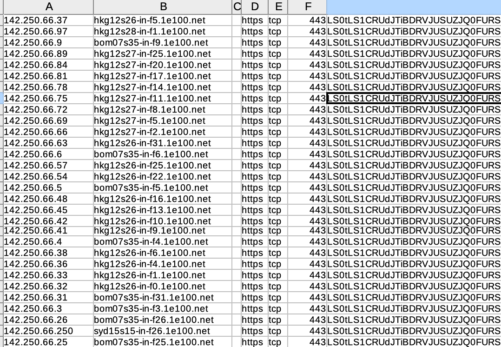

# SSL Certificate Discovery in the Wild

This note presents a method to discover SSL certificate used in TLS using network discovery. The solution stores them into CSV files.
The advantage of the solution is that it is free and opensource 😎.

**The method leverages [Nmap](https://nmap.org/) and the scripting engine. The user can also refers to the `ssl_cert`script from the Nmap distribution**. 


## Usage

The solution requires to uses `Nmap` and the script `discovery-certificate-csv.nse`. I have released the script under **GNU GPLv2**.
Scripting in `Nmap` is discussed in this [page](https://nmap.org/book/nse.html). 

- **IP/Port Arguments**: Nmap standard arguments are used for port and domain ranges. 

	- Port range are expressed as `x-y`
	- Nmap supports *CIDR-style* or *IP-style* such as `10.2.3.1-254`
- **CSV Output**: Results are stored into the CSV files given as argument:`"csv_output.basepath='result.csv'"`

*Example:*

```
 nmap --script discovery-certificate-csv.nse  -p 443-9999 192.168.20.1-5 --script-args "csv_output.basepath='result.csv'"
```

The ouput is a CSV with a `,` as separator and with columns such as

1. `host.ip` 
2. `host.name` 
3. `host.targetname` [domain]
4. `port.service` [tcp]
5. `port.protocol` [https]
6. `port.number` 
7. `x509 Server's Certificate` in base64


## Example
```
MacBookdebruno:~ bruno$ nmap --script discovery-certificate-csv.nse  -p 443 142.250.66.1-254  --script-args "csv_output.basepath='result.csv'"
Starting Nmap 7.91 ( https://nmap.org ) at 2021-09-26 17:21 AEST
Nmap scan report for bom07s35-in-f2.1e100.net (142.250.66.2)
Host is up (0.25s latency).

PORT    STATE SERVICE
443/tcp open  https
|_discovery-certificate-csv: true

Nmap scan report for bom07s35-in-f3.1e100.net (142.250.66.3)
Host is up (0.25s latency).

PORT    STATE SERVICE
443/tcp open  https
|_discovery-certificate-csv: true

Nmap scan report for bom07s35-in-f4.1e100.net (142.250.66.4)
Host is up (0.25s latency).


PORT    STATE SERVICE
443/tcp open  https
|_discovery-certificate-csv: true


PORT    STATE SERVICE
443/tcp open  https
|_discovery-certificate-csv: true

Nmap done: 254 IP addresses (142 hosts up) scanned in 57.98 seconds
```



## Business Use Case

The tool can be used to collect on any DMZ all the exposed certificates. The PEM can then later be decapsulated for analysis and x509 field extraction.

😎💥💥 **Happy Certificate Hunting**. 😈

